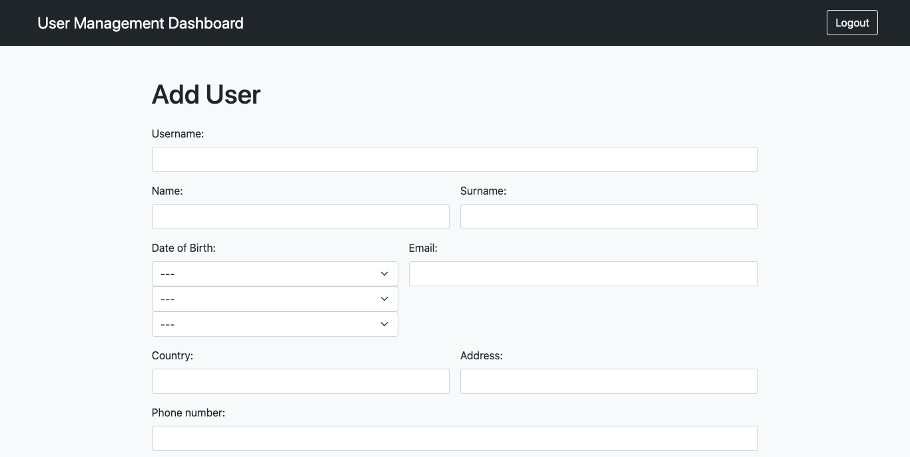

# Admin Dashboboard 

Web application built with Django, utilizing Jinja2 and jQuery to create a responsive and user-friendly admin dashboard. It leverages the power of Bootstrap to enhance the application's visual aesthetics and provide a consistent and modern UI experience.

## Features

- User Management: The application provides functionality for managing user accounts, including registration, login, and password reset.

- Dashboard Overview: The dashboard offers an overview of key metrics and statistics, providing administrators with insights into the system's performance.

- Data Visualization: The application includes charts and graphs to visually represent data, making it easier to understand and analyze information.

- CRUD Operations: Administrators can perform CRUD (Create, Read, Update, Delete) operations on various data entities, such as users, products, orders, etc.

## Technologies Used

The Admin Dashboard Django Bootstrap project utilizes the following technologies:

- Django: Django is a high-level Python web framework that provides a clean and efficient way to build web applications.

- Jinja2: Jinja2 is a templating engine for Python used to create dynamic HTML templates.

- jQuery: jQuery is a fast, small, and feature-rich JavaScript library that simplifies HTML document traversal and manipulation.

- Bootstrap: Bootstrap is a popular HTML, CSS, and JavaScript framework that provides pre-designed components and responsive layouts, allowing for rapid and consistent web development.

## Usage

To use the Admin Dashboard Django Bootstrap application locally, follow these steps:

1. Clone the repository: `git clone https://github.com/ak-hu/admin-dashboard-django-bootstrap.git`
2. Install the required dependencies by running `pip install -r requirements.txt` in the project directory.
3. Configure the database connection and other settings in the `settings.py` file.
4. Run database migrations with `python manage.py migrate`.
5. Start the development server with `python manage.py runserver`.
6. Access the application in your web browser at `http://localhost:8000`.

To log in to the application, use the following credentials:

- **Username:** admin
- **Password:** 123123

Please note that this is a basic setup guide, and additional steps may be required depending on your specific environment and deployment requirements.

## Screenshots

*Login Page*

*Dashboard Page*

*Add Page*

*Edit Page*

## Contributing

Contributions to the Admin Dashboard Django Bootstrap project are welcome! If you have any ideas for improvements, bug fixes, or new features, feel free to open an issue or submit a pull request.

Please make sure to follow the existing coding style and guidelines when contributing.

## License

This project does not have a specific license.
